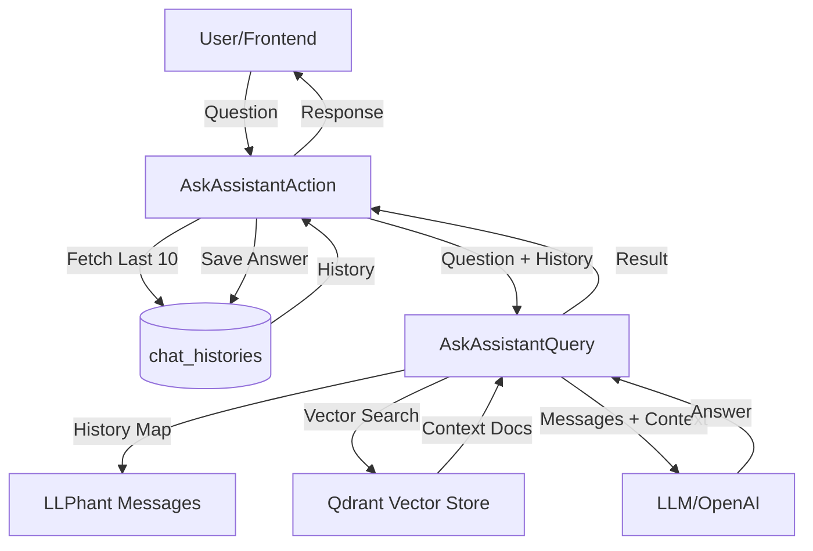

# Requirements

### Overview & Goals
The goal is to enable the assistant to remember previous messages in a conversation. Currently, each question is treated as a standalone request, causing the assistant to lose context (e.g., it cannot answer "Who is he?" if the person was mentioned in the previous message).

### Scope
- **In Scope**:
    - Storing and retrieving chat history from the existing `chat_histories` database table.
    - Sending the last N messages (sliding window) to the LLM as part of the prompt context.
    - Maintaining RAG functionality (vector search) alongside history context.
- **Out of Scope**:
    - Implementing Redis-based storage (database is used for persistence and simplicity).
    - Streaming responses (frontend currently uses standard POST requests).
    - Complex query rewriting based on history.

### User Stories
- **As a user**, I want to have a continuous dialogue with the assistant so that I don't have to repeat context in every message.
- **As a user**, I want the assistant to understand references to previous parts of our conversation.

# Technical Design

### Current Implementation
- `AskAssistantAction` calls `AskAssistantQuery` with only the current question.
- `AskAssistantQuery` uses `LLPhant\Query\SemanticSearch\QuestionAnswering::answerQuestion()`, which does not accept history.
- `ChatHistory` model exists and correctly records every exchange, but these records are only used for display in the frontend.

### Proposed Changes
1. **Dialogue Storage**: We will continue using the `chat_histories` table. It already has the necessary fields (`assistant_id`, `user_id`, `question`, `answer`).
2. **Context Window**: We will use a sliding window of the last **10 messages** (5 exchange pairs) to provide sufficient context while staying within token limits.
3. **LLM Integration**: 
    - Convert `ChatHistory` records into `LLPhant\Chat\Message` objects.
    - Use `LLPhant`'s `answerQuestionFromChat()` method.
    - This method performs vector search based on the *latest* message but sends the *entire* history to the LLM, allowing it to synthesize answers using both the retrieved documents and the dialogue context.

### Architecture Diagram

### File Structure
- `app/Domain/Chat/Actions/AskAssistantAction.php`: Modified to fetch history and pass it.
- `app/Domain/Chat/Queries/AskAssistantQuery.php`: Modified to handle history and use `answerQuestionFromChat`.

# Testing

### Validation Approach
I will verify the changes by:
1. Ensuring that the assistant can correctly answer follow-up questions (e.g., "Tell me more about the person I mentioned").
2. Verifying that the vector search still works correctly for the latest message.
3. Checking that the database still stores history correctly without duplicates or errors.

### Key Scenarios
- **Scenario 1**: Ask a specific question about a document. Then ask "Give me more details about that". The assistant should use the previous context to know what "that" refers to.
- **Scenario 2**: Empty history. The assistant should work as before for the first message.
- **Scenario 3**: Long history (>10 messages). The assistant should only receive the most recent 10 messages to avoid token overflow.

# Delivery Steps

### ✓ Step 1: Extend AskAssistantQuery with history support
Update `AskAssistantQuery` to support conversation history.
- Modify the `execute` method signature to accept an optional `Collection` of historical messages.
- Implement logic to map database history records into `LLPhant\Chat\Message` objects (User/Assistant pairs).
- Replace the call to `answerQuestion()` with `answerQuestionFromChat()`, passing the full message array to provide context to the LLM.

### ✓ Step 2: Integrate history retrieval in AskAssistantAction
Update `AskAssistantAction` to retrieve and pass the dialogue history.
- Add logic to fetch the latest 10 messages from the `chat_histories` table for the current user and assistant.
- Ensure the history is ordered correctly (chronological) before passing it to the query.
- Pass the retrieved history to the updated `AskAssistantQuery::execute()` method.