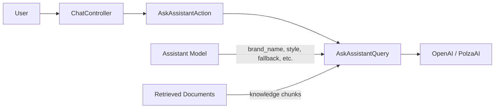

# Requirements

### Overview & Goals
Enhance the `Assistant` model with configuration fields that define its personality, company context, and fallback behavior. This allows the AI agent to provide more brand-aligned responses, maintain a specific tone, and handle off-topic or unknown questions gracefully.

### Scope
- **In Scope**:
    - Adding fields: `style`, `brand_name`, `phone`, `social`, `fallback`.
    - Implementing a `style` Enum with predefined instructions (commercial, business, rude, positive).
    - Updating AI query logic to incorporate these fields into the system prompt.
    - Implementing strict constraints for off-topic questions.
    - Providing a fallback message for unknown answers.
- **Out of Scope**:
    - Frontend UI changes (Inertia templates).
    - Changes to the RAG retrieval mechanism (embeddings/vector search).

### Functional Requirements
- The assistant must have a selectable style (commercial, business, rude, or positive).
- Each style must influence the tone of the AI response via predefined prompt instructions.
- Company details (brand name, description, phone, social) must be included in the AI context.
- The agent must be strictly constrained to only answer questions related to the company and provided context.
- If the agent cannot find an answer, it must return the configured `fallback` message.

# Technical Design

### Current Implementation
- `Assistant` model has basic fields (`name`, `description`).
- `AskAssistantQuery` uses `LLPhant`'s `QuestionAnswering` with a default system message template.
- Conversations are handled via `ChatController` and `AskAssistantAction`.

### Proposed Changes
#### 1. Data Model Updates
- **Enum `AssistantStyle`**: Defines the 4 styles and their corresponding Russian instructions for the LLM.
- **Migration**: Adds `style` (string), `brand_name` (string), `phone` (string), `social` (json), and `fallback` (text) to the `assistants` table.
- **Model `Assistant`**: Casts `style` to the new Enum and `social` to `array`.

#### 2. System Prompt Engineering
Update `AskAssistantQuery` to construct a dynamic system prompt. The template will be structured as follows:
```text
Вы — помощник бренда {brand_name}.
Описание компании: {description}
Контактный телефон: {phone}
Социальные сети: {socials}

Стиль общения: {style_instruction}

ИНСТРУКЦИИ:
1. Используйте предоставленные фрагменты контекста для ответа на вопрос пользователя.
2. Отвечайте ТОЛЬКО на вопросы, связанные с деятельностью компании и предоставленным контекстом. 
3. Если вопрос не относится к компании или контексту, или вы не знаете ответа, используйте следующий текст ответа: {fallback}
4. Не выдумывайте факты, которых нет в контексте.

Контекст: {context}
```

#### 3. Controller & Action Updates
- `AssistantController` will validate the new fields during store/update operations.
- `StoreAssistantAction` and `UpdateAssistantAction` will remain thin, passing the validated data to Eloquent.

### Architecture Diagram


### File Structure
- `app/Domain/Assistant/Enums/AssistantStyle.php` (New)
- `database/migrations/YYYY_MM_DD_HHMMSS_add_extended_fields_to_assistants_table.php` (New)
- `app/Domain/Assistant/Models/Assistant.php` (Modified)
- `app/Domain/Chat/Queries/AskAssistantQuery.php` (Modified)
- `app/Http/Controllers/AssistantController.php` (Modified)
- `app/Domain/Assistant/Actions/StoreAssistantAction.php` (Modified - PHPDoc)
- `app/Domain/Assistant/Actions/UpdateAssistantAction.php` (Modified - PHPDoc)

# Testing

### Validation Approach
Verification will focus on ensuring the new fields are correctly stored and that the AI incorporates them into its responses.

### Key Scenarios
- **Style Consistency**: Verify that changing the `style` to "Rude" or "Positive" results in a noticeable change in the tone of the response.
- **Company Context**: Ask "What is your brand name?" or "How can I contact you?" to verify the agent uses `brand_name`, `phone`, and `social`.
- **Off-topic Rejection**: Ask a question unrelated to the company (e.g., "What's the weather in London?") and verify it returns the `fallback` message.
- **Fallback for Unknowns**: Ask a company-related question that is NOT in the knowledge base and verify it returns the `fallback` message.

### Edge Cases
- **Missing Fields**: If `brand_name` or `phone` is null, the system prompt should handle it gracefully (e.g., omitting the line).
- **Empty Fallback**: If no `fallback` message is provided, a default polite refusal should be used.
- **Invalid Style**: Ensure validation prevents saving an unsupported style.

# Delivery Steps

###   Step 1: Create AssistantStyle Enum
Define the response styles (commercial, business, rude, positive) as a PHP Enum.
- Create `app/Domain/Assistant/Enums/AssistantStyle.php`.
- Add `getInstruction()` method to return the prompt instruction for each style in Russian.

###   Step 2: Update Database Schema and Model
Add new fields to the `assistants` table.
- Create a migration to add `style`, `phone`, `social`, `brand_name`, and `fallback` columns.
- Update `app/Domain/Assistant/Models/Assistant.php` to include these fields in `$fillable` and add `$casts` for `style` (Enum) and `social` (array).
- Update `database/factories/Domain/Assistant/Models/AssistantFactory.php` with default values.

###   Step 3: Update Assistant Controller and Actions
Allow users to save and update the new assistant settings.
- Update `app/Http/Controllers/AssistantController.php` validation in `store` and `update` methods.
- Update PHPDoc for `StoreAssistantAction` and `UpdateAssistantAction` to reflect new fields.
- Update `tests/Feature/AssistantTest.php` to verify new fields are correctly validated and saved.

###   Step 4: Implement AI Logic with Custom System Prompt
Implement the custom system prompt logic to guide the agent's behavior.
- Modify `app/Domain/Chat/Queries/AskAssistantQuery.php` to build a detailed system prompt using assistant settings.
- Include brand name, company description, contact info, social networks, and style instructions in the prompt.
- Add strict instructions to only answer relevant questions and use the `fallback` message for unknown queries.
- Create or update a test to verify the system prompt construction in `AskAssistantQuery`.