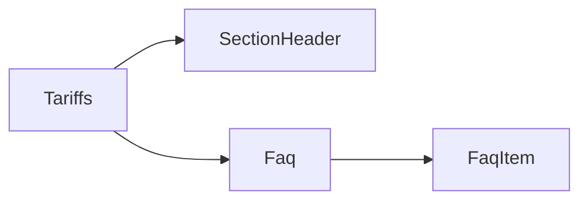

# Requirements

### Overview & Goals
Разработать красивый FAQ-компонент по референсу `referense_design/faqs.png` и внедрить его на страницу тарифов (`Tariffs.tsx`).

### Functional Requirements
- Двухколоночная сетка вопросов/ответов (как в референсе)
- Иконки слева от каждого вопроса (Lucide)
- SectionHeader с иконкой и заголовком секции
- Подзаголовок под заголовком секции
- Данные FAQ уже есть в `Tariffs.tsx` (`tariffFaqs`), нужно добавить больше вопросов
- Секция размещается ниже карточек тарифов на странице `Tariffs.tsx`

### Out of Scope
- Аккордеон/раскрытие (в референсе вопросы статичные, без collapse)
- Backend API для FAQ

# Technical Design

### Current Implementation
- `resources/js/Pages/Tariffs.tsx` — страница тарифов, уже содержит массив `tariffFaqs` (4 вопроса) и импорт `SectionHeader`
- `resources/js/Components/Faq.tsx` — файл существует, но пустой
- `resources/js/Components/UI/SectionHeader.tsx` — готовый компонент с иконкой, заголовком и декоративной линией
- Дизайн-система: тёмная тема, акцент `#DFFF00`, карточки `bg-background-one border-border-color-one rounded-three`

### Key Decisions
- Компонент `Faq.tsx` реализуется как переиспользуемый, принимает `items: { question, answer, icon? }[]`
- Двухколоночная сетка через `grid grid-cols-1 md:grid-cols-2`
- Каждый FAQ-item: иконка в кружке (стиль `bg-primary-rgb-12 border-primary-color`) + вопрос жирным + ответ серым
- Без аккордеона — статичный список как в референсе

### Proposed Changes
- Заполнить `resources/js/Components/Faq.tsx` — переиспользуемый компонент
- Расширить массив `tariffFaqs` в `Tariffs.tsx` до 8–10 вопросов
- Добавить секцию FAQ в `Tariffs.tsx` после блока тарифных карточек

### File Structure
```
resources/js/
  Components/
    Faq.tsx              ← заполнить (сейчас пустой)
  Pages/
    Tariffs.tsx          ← добавить секцию FAQ
```

### Architecture Diagram


# Testing

### Validation Approach
Фичер-тест на рендер страницы тарифов с FAQ-секцией.

### Key Scenarios
- GET `/tariffs` возвращает 200 и содержит текст FAQ-вопросов
- Компонент `Faq` рендерится с переданными items

# Delivery Steps

### ✓ Step 1: Implement Faq component
Переиспользуемый компонент `Faq.tsx` реализован и отображает двухколоночную сетку вопросов/ответов по дизайну референса.

- Заполнить `resources/js/Components/Faq.tsx`
- Props: `items: { question: string; answer: string; icon?: LucideIcon }[]`, опциональный `className`
- Двухколоночная сетка `grid grid-cols-1 md:grid-cols-2 gap-8`
- Каждый item: иконка в кружке `bg-primary-rgb-12 border border-primary-color rounded-full` + вопрос `font-title text-white-color` + ответ `text-text-secondary-dark text-sm`
- Стиль строго по дизайн-системе (токены из `DESIGN_UI.md`)

### ✓ Step 2: Integrate FAQ section into Tariffs page
Страница тарифов содержит секцию FAQ с SectionHeader и расширенным списком вопросов.

- Расширить массив `tariffFaqs` в `Tariffs.tsx` до 8–10 вопросов (добавить иконки Lucide к каждому)
- Добавить секцию FAQ ниже блока карточек тарифов: `SectionHeader` с иконкой `HelpCircle` и подзаголовком
- Подключить компонент `<Faq items={tariffFaqs} />`
- Написать/обновить feature-тест на рендер страницы тарифов