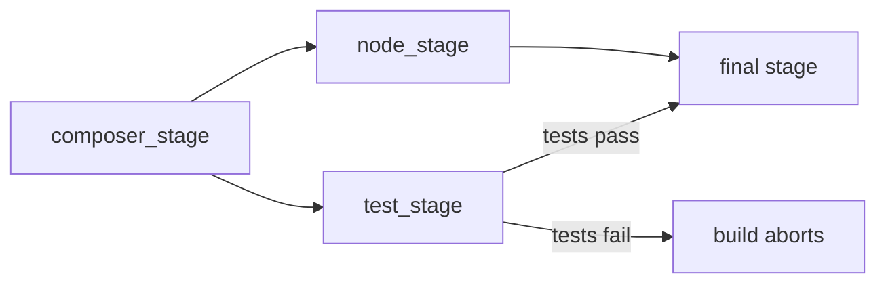

# Requirements

### Overview & Goals

Two related problems to solve:

1. **Test DB isolation** — when tests run, they must never touch the production/development PostgreSQL database. Tests should use an isolated SQLite in-memory database (already configured in `phpunit.xml`) without risk of clearing real data.
2. **Deploy gate** — before deploying (building the production Docker image), tests must run and pass. If any test fails, the build/deploy must abort.

### Scope

**In Scope:**
- Fix `.env` / `phpunit.xml` interaction so tests always use SQLite `:memory:`
- Add a `.env.testing` file to guarantee test environment isolation
- Add a test stage to the `Dockerfile` multi-stage build that runs tests before producing the final image
- Ensure the `Dockerfile` final stage only proceeds if tests pass

**Out of Scope:**
- CI/CD platform configuration (GitHub Actions, GitLab CI, etc.)
- Changing the test framework or database driver for tests

# Technical Design

### Current Implementation

- `phpunit.xml` sets `DB_CONNECTION=sqlite`, `DB_DATABASE=:memory:`, `DB_URL=""` — correct in theory
- `.env` sets `DB_CONNECTION=pgsql` pointing to the Sail PostgreSQL container
- No `.env.testing` file exists — Laravel falls back to `.env`, and some env vars (especially `DB_URL` if set) can override `phpunit.xml` settings
- `Dockerfile` is a 3-stage build (composer → node → final); it **removes `tests/`** in the final stage and never runs tests
- `docker/entrypoint.sh` runs migrations at container start — no test execution

### Root Cause of DB Clearing

When running `./vendor/bin/sail artisan test`, if `DB_URL` or `DATABASE_URL` is set in the environment (Docker passes env vars), it can override the `phpunit.xml` `<env>` settings. The `RefreshDatabase` trait then runs against the real PostgreSQL DB, wiping it.

### Key Decisions

1. **`.env.testing`** — create this file to explicitly set SQLite `:memory:` for all test runs. Laravel automatically loads `.env.testing` when `APP_ENV=testing`, taking precedence over `.env`.
2. **Docker test stage** — add a 4th stage (`test_stage`) in the `Dockerfile` that installs dev dependencies, copies the app, and runs `php artisan test`. The final production stage uses `COPY --from=test_stage` to implicitly depend on it — if tests fail, the build fails.

### Proposed Changes

#### 1. Create `.env.testing`
```
APP_ENV=testing
APP_KEY=base64:test_key_placeholder
DB_CONNECTION=sqlite
DB_DATABASE=:memory:
DB_URL=
CACHE_STORE=array
QUEUE_CONNECTION=sync
SESSION_DRIVER=array
MAIL_MAILER=array
```

#### 2. Add test stage to `Dockerfile`

Insert between `node_stage` and the final stage:

```dockerfile

# Stage 3: Run Tests (gate for production build)

FROM php:8.5-fpm-alpine AS test_stage

WORKDIR /var/www/html

RUN apk add --no-cache libzip libpng libpq icu-libs \
    && apk add --no-cache --virtual .build-deps \
        $PHPIZE_DEPS libzip-dev libpng-dev postgresql-dev icu-dev zlib-dev \
    && docker-php-ext-install bcmath pdo_pgsql zip pcntl \
    && pecl install redis && docker-php-ext-enable redis \
    && apk del .build-deps

COPY --from=composer:latest /usr/bin/composer /usr/bin/composer

# Install ALL dependencies (including dev) for testing

COPY composer.json composer.lock ./
RUN composer install --no-scripts --no-autoloader --prefer-dist --ignore-platform-reqs

COPY . .
RUN composer dump-autoload

# Run tests — build fails here if any test fails

RUN php artisan test --no-ansi
```

Then in the final stage, add a `COPY` from `test_stage` to create the dependency:
```dockerfile

# Implicitly require test_stage to have passed

COPY --from=test_stage /var/www/html/vendor/autoload.php /dev/null
```

### File Structure

 File | Action |
------|--------|
 `.env.testing` | **Create** — test environment overrides |
 `Dockerfile` | **Modify** — add `test_stage` between node and final stages |

### Architecture Diagram



# Testing

### Validation Approach

- Run `./vendor/bin/sail artisan test` and verify it uses SQLite `:memory:` (no PostgreSQL data loss)
- Build the Docker image with `docker build .` and confirm it succeeds when tests pass
- Introduce a deliberate test failure and confirm `docker build .` aborts

### Key Scenarios

1. Tests run locally via Sail → use SQLite in-memory, production DB untouched
2. `docker build .` with all tests passing → image built successfully
3. `docker build .` with a failing test → build exits non-zero, no image produced

### Edge Cases

- `DB_URL` set in environment overriding phpunit settings → `.env.testing` explicitly clears it
- Tests that require PostgreSQL-specific features → document that they must be skipped or mocked in the test stage

# Delivery Steps

### ✓ Step 1: Create .env.testing to isolate test database
A `.env.testing` file exists that guarantees tests always use SQLite `:memory:` regardless of `.env` contents.

- Create `.env.testing` at project root with `DB_CONNECTION=sqlite`, `DB_DATABASE=:memory:`, `DB_URL=` (empty), and all other test-safe overrides (`CACHE_STORE=array`, `QUEUE_CONNECTION=sync`, `SESSION_DRIVER=array`, `MAIL_MAILER=array`)
- Add `.env.testing` to `.gitignore` if it contains secrets, or commit it (it has no secrets — safe to commit)
- Verify by running `./vendor/bin/sail artisan test` and confirming no PostgreSQL queries hit the dev database

### ✓ Step 2: Add test stage to Dockerfile as a build gate
The `Dockerfile` multi-stage build runs all Pest tests before producing the final image; a test failure aborts the build.

- Add a new `test_stage` (Stage 3) in `Dockerfile` after `node_stage` and before the final production stage
- In `test_stage`: install PHP + required extensions, install all Composer dependencies (including dev), copy app files, run `php artisan test --no-ansi`
- In the final production stage: add `COPY --from=test_stage /var/www/html/vendor/autoload.php /dev/null` to create an explicit dependency on `test_stage` completing successfully
- Verify with `docker build .` — build succeeds with passing tests and fails when a test is broken