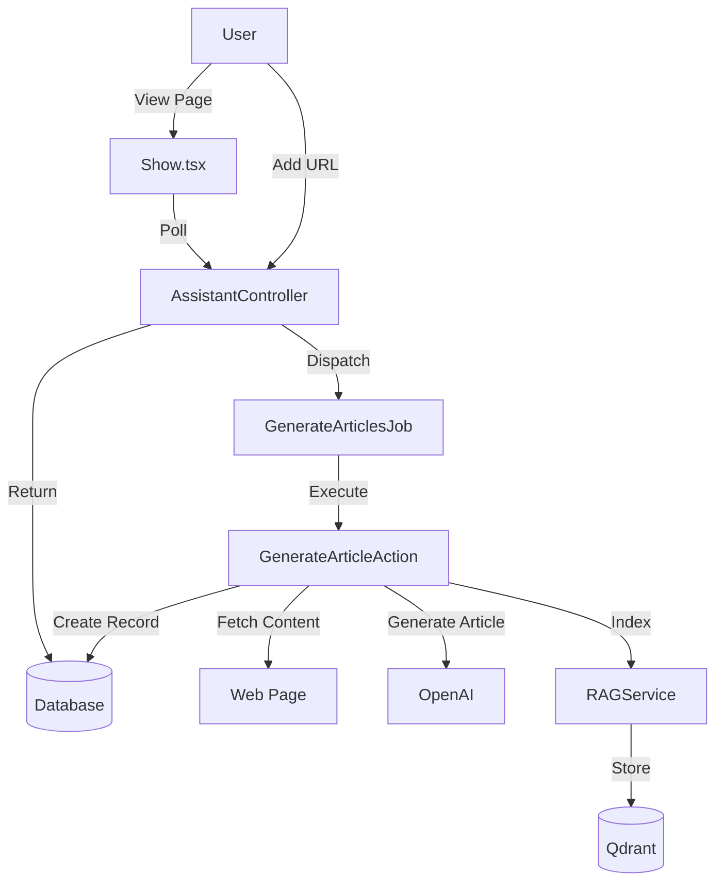

# Requirements

### Overview & Goals
The current URL addition process lacks visual feedback and doesn't display the results of the processing. This task aims to make the article generation process transparent and the results (recognized information) visible to the user in the form of interactive cards.

### Scope
- **Frontend**: `resources/js/Pages/Assistants/Show.tsx`
- **Backend**: `app/Domain/Article/Actions/GenerateArticleAction.php`

### Functional Requirements
- Display recognized information from URLs as Markdown-formatted cards.
- Show "Processing..." or "Generating..." state for each individual URL.
- Automatically refresh the list of articles as they are completed.
- Index article content into the RAG system so the assistant can use this information in chat.

# Technical Design

### Current Implementation
- `AssistantController@addUrl` dispatches `GenerateArticlesJob`.
- `GenerateArticleAction` creates an `Article` record with `processing` status, retrieves web content, generates an article via GPT, and updates the record to `ready`.
- `Show.tsx` only displays article title and status, with no polling for individual article updates.

### Proposed Changes
#### Frontend (`Show.tsx`)
- **Interface**: Extend `Article` to include `title` and `content`.
- **Polling**: Update `useEffect` to poll if `assistant.articles.some(a => a.status === 'processing')`.
- **UI**: Replace the simple list with a grid of cards. Each card will show the title, URL, status, and a scrollable area with Markdown content (using `react-markdown`).
- **Feedback**: Remove blocking `alert()` calls.

#### Backend (`GenerateArticleAction`)
- **RAG Integration**: Call `RAGService::indexDocuments` after article generation to make the information searchable.
- **Assistant Status**: Set `assistant.status` to `processing` when starting work to provide consistent feedback in the sidebar.

### File Structure
- `resources/js/Pages/Assistants/Show.tsx`: Main UI changes.
- `app/Domain/Article/Actions/GenerateArticleAction.php`: Logic for indexing and status updates.

### Architecture Diagram

# Delivery Steps

### ✓ Step 1: Enhance Article UI and Display Content
Update the `Article` interface and rendering logic in `resources/js/Pages/Assistants/Show.tsx`.
- Add `title` and `content` to the `Article` interface.
- Implement a card-based layout for articles.
- Integrate `react-markdown` to render article content.
- Replace `alert` notifications with subtle UI feedback or just rely on the processing state.

### ✓ Step 2: Improve Real-time Progress Tracking
Adjust the polling mechanism in `resources/js/Pages/Assistants/Show.tsx` to ensure real-time updates.
- Update the `useEffect` hook to poll when any article is in the `processing` state, even if the assistant itself is `ready`.
- Add proper handling for the `error` status in the article cards.

### ✓ Step 3: Integrate Articles with RAG and Improve Backend State
Update `GenerateArticleAction` to index the generated content.
- Import and use `RAGService` in `GenerateArticleAction`.
- Index the generated article content so the assistant can answer questions based on it.
- Ensure assistant status is updated to `processing` when article generation starts.