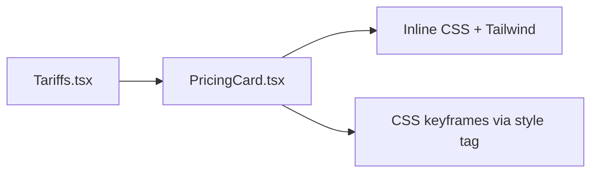

# Requirements

### Overview & Goals
Переработать карточки тарифов в стиле glassmorphism с анимированными градиентами. Первый тариф (Start) выделить как активный/рекомендуемый с особым визуальным акцентом.

### Scope
**In Scope:**
- Новый компонент `PricingCard` с glassmorphism-эффектом
- Анимированный градиентный фон/бордер для активной карточки
- Выделение первого тарифа (Start) как рекомендуемого
- Hover-анимации для всех карточек
- Плавающие частицы/блики на активной карточке

**Out of Scope:**
- Изменение логики подписки
- Изменение backend-части

### User Stories
- Как пользователь, я вижу красивые стеклянные карточки тарифов с анимациями и сразу понимаю, какой тариф рекомендуется.

# Technical Design

### Current Implementation
- `resources/js/Pages/Tariffs.tsx` — страница тарифов, карточки рендерятся inline без выделенного компонента
- Активная карточка: `plan.slug === 'business'` (highlighted), но задача — выделить первый тариф (Start)
- Дизайн-система: токены `--primary-color: #DFFF00`, `--background-one: #191919`, `--border-color-one: rgba(255,255,255,0.10)`, `--primary-rgb-12`

### Key Decisions
1. **Выделяемый тариф** — первый в массиве `plans[0]` (Start), а не `business`
2. **Glassmorphism** — реализуется через Tailwind inline-стили + CSS-переменные: `backdrop-blur`, полупрозрачный фон, градиентный бордер
3. **Анимации** — CSS `@keyframes` через Tailwind `animate-*` или inline `style` с CSS-переменными; анимированный градиент бордера через `background-size` animation
4. **Компонент** — выносим в `resources/js/Components/Tariffs/PricingCard.tsx`

### Proposed Changes

#### Glassmorphism-стиль карточки
```css
/* Обычная карточка */
background: rgba(25, 25, 25, 0.6);
backdrop-filter: blur(20px);
border: 1px solid rgba(255,255,255,0.10);
border-radius: 24px;

/* Активная (первая) карточка */
background: rgba(25, 25, 25, 0.4);
backdrop-filter: blur(30px);
border: 1px solid transparent;
background-image: linear-gradient(#191919, #191919), 
  linear-gradient(135deg, #DFFF00, rgba(255,255,255,0.3), #DFFF00);
background-origin: padding-box, border-box;
background-clip: padding-box, border-box;
animation: borderRotate 3s linear infinite;
```

#### Анимации
- `borderRotate` — вращение градиента бордера активной карточки
- `glowPulse` — пульсирующее свечение `box-shadow` с `--primary-color`
- `floatGlow` — плавающий блик в верхней части карточки
- Hover всех карточек: `translateY(-4px)` + градиентный бордер

### File Structure
```
resources/js/
  Components/
    Tariffs/
      PricingCard.tsx        ← новый компонент
  Pages/
    Tariffs.tsx              ← обновить: использовать PricingCard
```

### Architecture Diagram


# Testing

### Validation Approach
Визуальная проверка + Pest feature-тест рендера страницы тарифов.

### Key Scenarios
- Страница `/tariffs` отдаёт 200 и содержит карточки тарифов
- Первая карточка имеет маркер «Рекомендуем» / активный стиль
- Кнопка подписки работает корректно

### Test Changes
- Обновить/добавить `TariffsTest` — проверить наличие активного класса на первой карточке

# Delivery Steps

### ✓ Step 1: Создать компонент PricingCard с glassmorphism-стилем и анимациями
Компонент `PricingCard.tsx` реализован с glassmorphism-эффектом, анимированным градиентным бордером и выделением активной карточки.

- Создать `resources/js/Components/Tariffs/PricingCard.tsx`
- Реализовать glassmorphism: `backdrop-blur`, полупрозрачный фон `rgba(25,25,25,0.6)`, градиентный бордер через `padding-box/border-box`
- Для активной (первой) карточки: анимированный вращающийся градиентный бордер `#DFFF00 → white → #DFFF00`, пульсирующий `box-shadow` с `--primary-color`, бейдж «Рекомендуем» с градиентным фоном
- Добавить `<style>` блок с `@keyframes borderRotate`, `glowPulse`, `floatGlow`
- Hover-эффект: `translateY(-4px)` + появление градиентного бордера для неактивных карточек
- Плавающий блик (pseudo-element через inline div) в верхней части активной карточки

### ✓ Step 2: Интегрировать PricingCard в страницу Tariffs и обновить логику выделения
Страница `Tariffs.tsx` использует новый компонент, первый тариф выделен как рекомендуемый.

- Обновить `resources/js/Pages/Tariffs.tsx`: заменить inline-карточки на `<PricingCard>`
- Изменить логику `highlighted`: вместо `plan.slug === 'business'` использовать `index === 0` (первый тариф)
- Передать в `PricingCard` пропсы: `plan`, `isHighlighted`, `isCurrentPlan`, `onSubscribe`, `features`
- Убедиться, что анимации не конфликтуют с существующими стилями `pricing-item` из `main.css`
- Написать/обновить Pest feature-тест для страницы тарифов