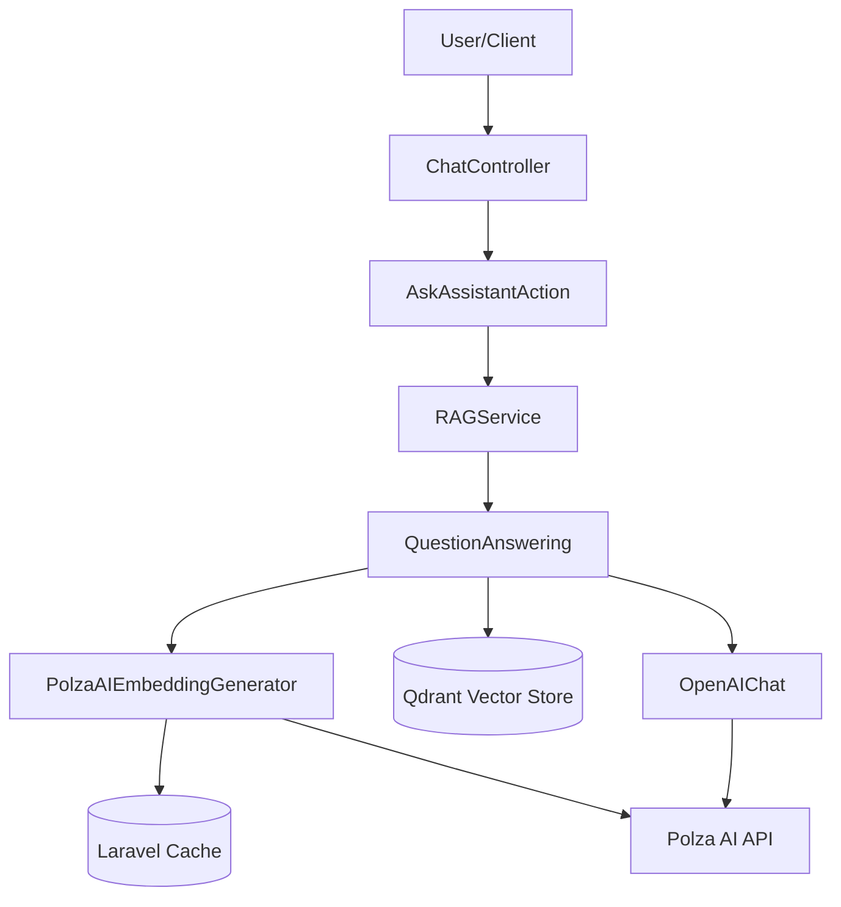

# Requirements

### Overview & Goals
The goal is to implement Polza AI embeddings in the `RAGService` following the provided documentation. The current implementation uses a hardcoded OpenAI ADA 002 generator which causes issues when using Polza AI models and results in 500 errors (due to 503 from the service and model mismatch).

### Scope
- **In Scope**:
  - Creation of a custom embedding generator for Polza AI.
  - Implementation of caching for embeddings.
  - Refactoring `RAGService` to use the new generator.
  - Ensuring compatibility with Polza AI's OpenAI-compatible API.
- **Out of Scope**:
  - Changing the vector store (Qdrant).
  - Modifying the chat completion logic (unless necessary for Polza AI compatibility).

### Functional Requirements
- Texts must be normalized before embedding (already partially implemented).
- Documents must be split into optimal chunks (already partially implemented).
- Embeddings must be cached to reduce API calls and latency.
- The system must correctly handle both "small" (1536) and "large" (3072) Polza AI embedding models.

# Technical Design

### Current Implementation
The `RAGService` currently uses `LLPhant\Embeddings\EmbeddingGenerator\OpenAI\OpenAIADA002EmbeddingGenerator`. This generator is hardcoded to use the `text-embedding-ada-002` model, which ignores the `OPENAI_EMBEDDING_MODEL` setting in `.env`.

### Proposed Changes
- **PolzaAIEmbeddingGenerator**: A new class that extends `AbstractOpenAIEmbeddingGenerator`. It will:
  - Use the model specified in the configuration.
  - Determine vector dimensions dynamically (1536 or 3072).
  - Use Laravel's `Cache` facade to store and retrieve embeddings by a hash of the content and model name.
- **RAGService Refactoring**:
  - Change the type hint of `$embeddingGenerator` to `EmbeddingGeneratorInterface`.
  - Use the new `PolzaAIEmbeddingGenerator` in `getEmbeddingGenerator()`.

### File Structure
- `app/Domain/Shared/AI/Embeddings/PolzaAIEmbeddingGenerator.php` (New)
- `app/Domain/Shared/AI/Services/RAGService.php` (Modified)

### Architecture Diagram

# Testing

### Validation Approach
I will use `php artisan tinker` to verify that the new generator correctly calls the Polza AI API (when it's available) and that results are being cached.

### Key Scenarios
1. **Embedding Generation**: Verify that `embedText` returns a vector of the correct length for the configured model.
2. **Caching**: Verify that subsequent calls for the same text do not trigger new API requests.
3. **RAG Flow**: Verify that the `ask` method in `RAGService` correctly retrieves context using the new generator and provides an answer.

# Delivery Steps

### ✓ Step 1: Create PolzaAIEmbeddingGenerator with caching support
Create a new generator class that implements the Polza AI specific requirements and supports caching.

- Create `app/Domain/Shared/AI/Embeddings/PolzaAIEmbeddingGenerator.php`.
- Extend `AbstractOpenAIEmbeddingGenerator` to leverage existing OpenAI client compatibility.
- Implement `getEmbeddingLength()` to dynamically return dimensions based on the model (1536 for small, 3072 for large).
- Implement `getModelName()` to use the model from configuration.
- Add caching to `embedText()` and `embedDocuments()` using Laravel's `Cache` to improve performance and reduce costs.

### ✓ Step 2: Update RAGService to use PolzaAIEmbeddingGenerator
Refactor RAGService to use the new generator and fix existing issues.

- Update `RAGService.php` to import `EmbeddingGeneratorInterface` and use it as the type for the embedding generator property.
- Update `getEmbeddingGenerator()` to instantiate `PolzaAIEmbeddingGenerator`.
- Ensure the model name is correctly passed from `config('llphant.openai.embedding_model')`.
- Verify that `QuestionAnswering` and other components correctly receive the new generator.