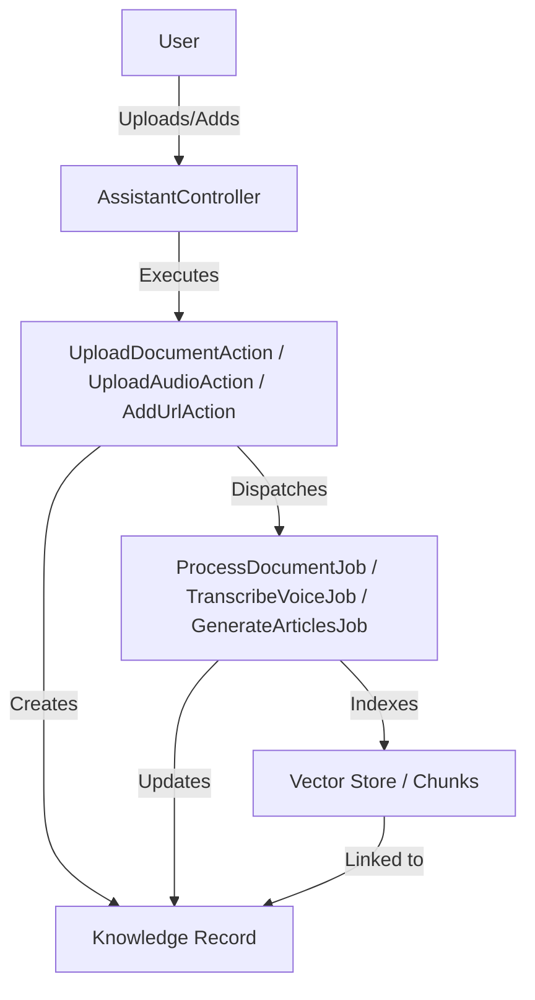

# Requirements

### Overview & Goals
The goal is to unify different types of knowledge sources (PDFs/Documents, Voice Messages, and Website Analysis) into a single `Knowledge` entity. This replaces the existing `Article` model and provides a more scalable way to "train" assistants with various data formats. The UI will be updated to display these sources in a clean, tabbed interface.

### Scope
- **In Scope**:
    - Creation of a new `Knowledge` model and database table.
    - Migration of data tracking from `Article` to `Knowledge`.
    - Refactoring of backend actions and background jobs to support the `Knowledge` model.
    - Updating the Assistant details page to use a tabbed interface for different knowledge types.
- **Out of Scope**:
    - Changing the underlying AI/Vector storage logic (Qdrant/LLPhant).
    - Implementing new types of knowledge sources beyond PDF/Doc, Voice, and URL.

### User Stories
- **As a user**, I want to upload documents (PDF, DOCX) so that my assistant can learn from them.
- **As a user**, I want to upload voice messages so that my assistant can use transcribed information as knowledge.
- **As a user**, I want to add website URLs so that my assistant can analyze and learn from site content.
- **As a user**, I want a organized UI where different types of knowledge sources are easily accessible via tabs.

### Functional Requirements
- Support three types of knowledge sources: `document`, `voice`, and `website`.
- Track processing status (pending, processing, ready, error) for each knowledge item.
- Provide a unified list of knowledge items for each assistant, grouped by type in the UI.
- Allow deleting individual knowledge items.
- Automatically update the UI when processing of a source is complete.

# Technical Design

### Current Implementation
- **Articles**: Currently used only for URL sources. Tracked in `articles` table.
- **Documents & Audio**: Currently uploaded and processed into `chunks` directly, with no persistent record other than the raw chunks.
- **UI**: All sources are listed in a single section on the Assistant Show page.

### Proposed Changes
- **Database Schema**:
    - New `knowledge` table:
        ```php
        Schema::create('knowledge', function (Blueprint $table) {
            $table->id();
            $table->foreignId('assistant_id')->constrained()->cascadeOnDelete();
            $table->string('type'); // 'document', 'voice', 'website'
            $table->string('name')->nullable();
            $table->string('url')->nullable();
            $table->string('path')->nullable();
            $table->longText('content')->nullable();
            $table->string('status')->default('pending');
            $table->json('metadata')->nullable();
            $table->timestamps();
        });
        ```
    - Update `chunks` table to include `knowledge_id`.
- **Domain Layer**:
    - Create `app/Domain/Knowledge/Models/Knowledge.php`.
    - Move/Refactor `Article` logic into the `Knowledge` domain.
- **UI Changes**:
    - Implement a `Tabs` component or use a simple state-based tab switcher in `Show.tsx`.
    - Group `assistant.knowledge` by `type` for display in respective tabs.

### Architecture Diagram


### File Structure
- `app/Domain/Knowledge/Models/Knowledge.php` (New)
- `database/migrations/xxxx_create_knowledge_table.php` (New)
- `database/migrations/xxxx_update_chunks_table_for_knowledge.php` (New)
- `app/Domain/Assistant/Actions/` (Updated)
- `app/Domain/Assistant/Jobs/` (Updated)
- `app/Http/Controllers/AssistantController.php` (Updated)
- `resources/js/Pages/Assistants/Show.tsx` (Updated)

# Testing

### Validation Approach
Verification will be done by testing the full flow for each knowledge type.

### Key Scenarios
1. **Document Upload**:
    - Upload a PDF.
    - Verify a `Knowledge` record of type `document` is created.
    - Verify chunks are created and linked to the `Knowledge` record.
    - Verify status updates from `pending` to `ready`.
2. **Voice Upload**:
    - Upload an MP3.
    - Verify `Knowledge` record of type `voice` is created.
    - Verify transcription text is saved in `Knowledge` content.
    - Verify chunks are created.
3. **Website Analysis**:
    - Add a URL.
    - Verify `Knowledge` record of type `website` is created.
    - Verify content is scraped and saved.
    - Verify chunks are created.

### Edge Cases
- **Invalid File Type**: Ensure validation catches unsupported formats.
- **Large Files**: Ensure queue handles timeouts or large payloads.
- **Scraping Failure**: Ensure status is set to `error` if URL is unreachable.
- **Empty Transcription**: Ensure error handling if audio is silent or unreadable.

# Delivery Steps

### ✓ Step 1: Implement Knowledge database schema and model
Knowledge table and model with source types.

- Create migration for `knowledge` table with `assistant_id`, `type` (enum), `name`, `url`, `path`, `content`, `status`, `metadata`.
- Create `App\Domain\Knowledge\Models\Knowledge` model.
- Add `knowledge` relationship to `Assistant` model.
- Migration to add `knowledge_id` to `chunks` table and mark `article_id` as deprecated/removable.

### ✓ Step 2: Refactor Backend Actions and Jobs to use Knowledge model
Update upload and analysis actions to work with the new model.

- Refactor `UploadDocumentAction`, `UploadAudioAction`, and `AddUrlAction` to create `Knowledge` records instead of (or in addition to) existing flows.
- Update `ProcessDocumentJob`, `TranscribeVoiceJob`, and `GenerateArticlesJob` to accept `Knowledge` model and update its status/content.
- Ensure that `IndexAssistantDocumentsAction` associates chunks with the `Knowledge` record via `knowledge_id`.

### ✓ Step 3: Update AssistantController and Queries for Knowledge support
Update AssistantController to support Knowledge management.

- Update `uploadDocument`, `uploadAudio`, and `addUrl` methods to use the refactored actions.
- Implement `destroyKnowledge` method in `AssistantController`.
- Update `GetAssistantWithDetailsQuery` to load `knowledge` relationship.
- Ensure appropriate authorization for the new `Knowledge` model.

### ✓ Step 4: Refactor Frontend UI with Tabbed Knowledge Sources
Implement tabbed interface for Knowledge sources.

- Refactor `resources/js/Pages/Assistants/Show.tsx` to use a tabbed UI for "Documents", "Voice", and "Websites".
- Separate the list of sources and their respective upload/add forms into these tabs.
- Ensure the progress indicators and status updates work correctly within each tab.
- Add "Delete" functionality for each knowledge item.