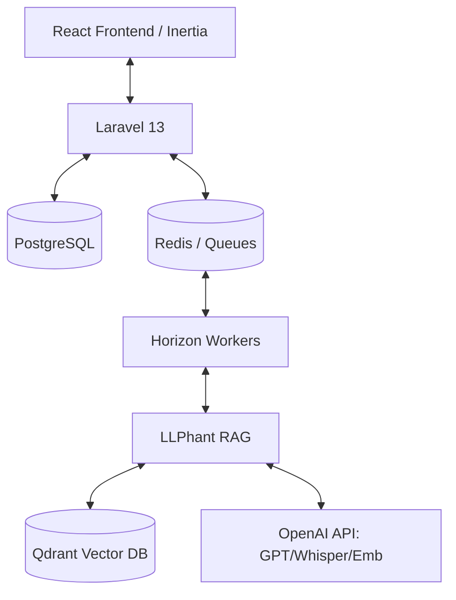

# Requirements (RU)

### Overview & Goals
Цель проекта — создать MVP сервиса для быстрой сборки AI-ассистентов с использованием RAG-пайплайна. Пользователи смогут загружать документы (PDF) или записывать голосовые сообщения для обучения ассистента, после чего общаться с ним в чате, получая ответы на основе предоставленных данных. Дополнительно сервис позволяет генерировать статьи на основе анализа сайтов конкурентов.

### Scope
- **In Scope**:
    - Регистрация и аутентификация пользователей (Laravel Breeze).
    - Управление ассистентами (CRUD).
    - Загрузка и векторизация PDF-документов через LLPhant.
    - Транскрипция голоса через Whisper и индексация в векторной БД.
    - RAG-чат с поддержкой источников (цитирование чанков).
    - Генерация статей по URL конкурента.
    - Интеграция с Qdrant (векторное хранилище).
- **Out of Scope**:
    - Оплата и подписки (будет добавлено позже).
    - Интеграция с Telegram/WhatsApp (на данном этапе только веб-интерфейс).

### User Stories
- **Как пользователь**, я хочу загрузить PDF-файл, чтобы мой ассистент знал содержимое моих документов.
- **Как пользователь**, я хочу наговорить голосом описание компании, чтобы ассистент автоматически структурировал эти данные.
- **Как пользователь**, я хочу задавать вопросы ассистенту в чате и видеть, на какие части документов он опирался при ответе.
- **Как пользователь**, я хочу ввести ссылку на сайт конкурента и получить готовые статьи на аналогичные темы.

### Functional Requirements
- Автоматический чанкинг и генерация эмбеддингов при загрузке данных.
- Поддержка гибридного поиска (dense + sparse) для повышения точности ответов.
- Фоновая обработка тяжелых задач (парсинг, транскрипция, генерация) с уведомлением о прогрессе.
- Хранение истории переписки.

# Technical Design (RU)

### Current Implementation
Проект представляет собой чистую установку Laravel 13. Зависимости для React, Inertia, LLPhant и Qdrant еще не установлены.

### Key Decisions
- **Frameworks**: Laravel 13 + Inertia.js v2 + React 19.
- **Authentication**: Laravel Breeze (React starter kit) — выбран для быстрой настройки UI и типизации.
- **RAG Engine**: LLPhant — используется как основной фреймворк для RAG-пайплайна (Extract -> Split -> Embed -> Search -> QA).
- **Vector DB**: Qdrant — для хранения и быстрого поиска по векторам.
- **Background Processing**: Redis + Laravel Horizon для управления очередями.
- **Real-time Updates**: Inertia Polling (или Reverb) для отображения статуса обработки документов.

### Data Models
- `Assistant`: Основная сущность ассистента (имя, описание, статус, связь с пользователем).
- `Chunk`: Метаданные фрагментов текста (связь с ассистентом, ссылка на Qdrant ID, содержимое).
- `Article`: Генерируемый контент на основе внешних URL.
- `ChatHistory`: История вопросов и ответов.

### Architecture Diagram

### File Structure
- `app/Services/AI/RAGService.php` — логика RAG и гибридного поиска.
- `app/Jobs/` — фоновые задачи для обработки PDF, аудио и генерации статей.
- `resources/js/Pages/` — React-страницы (Dashboard, Assistants, Chat).
- `config/llphant.php` — конфигурация AI-сервисов.

# Testing (RU)

### Validation Approach
- **Тестирование RAG**: Проверка корректности извлечения контекста из загруженных PDF и генерации ответа.
- **Тестирование очередей**: Убедиться, что при сбое воркера задача может быть перезапущена без потери данных.
- **UI Тесты**: Проверка отображения статуса "Обработка..." в реальном времени.

### Key Scenarios
1. Загрузка PDF -> Проверка появления чанков в Qdrant -> Успешный ответ в чате по теме PDF.
2. Загрузка Аудио -> Транскрипция -> Создание чанков -> Успешный ответ в чате.
3. Ввод URL -> Генерация статьи -> Возможность редактирования в интерфейсе.

# Delivery Steps

### ✓ Step 1: Этап 1: Окружение и фундамент
Базовая настройка окружения и стека технологий.
- Настройка Docker (PostgreSQL, Redis, Qdrant).
- Установка Laravel Breeze с поддержкой React/Inertia/TypeScript.
- Настройка Tailwind CSS 4 и shadcn/ui.
- Установка и первичная настройка LLPhant и адаптера Qdrant.

### ✓ Step 2: Этап 2: Управление ассистентами и обработка данных
Создание моделей и пайплайнов обработки документов и голоса.
- Миграции и модели `Assistant`, `Chunk`, `Article`, `ChatHistory`.
- CRUD для управления ассистентами.
- Реализация `ProcessDocumentJob` для парсинга PDF через LLPhant.
- Реализация `TranscribeVoiceJob` для транскрипции аудио через OpenAI Whisper.
- Интеграция с Qdrant для сохранения эмбеддингов.

### * Step 3: Этап 3: Система RAG-чата
Разработка чат-интерфейса и RAG-пайплайна.
- Реализация `RAGService` для выполнения поиска и генерации ответов.
- Разработка React-компонента чата с поддержкой Markdown и отображением источников.
- Сохранение истории чатов в PostgreSQL.
- Реализация гибридного поиска (dense + sparse) в Qdrant.

###   Step 4: Этап 4: Генератор статей и Дашборд
Генерация контента и панель управления.
- Реализация `GenerateArticlesJob` для парсинга URL и генерации статей через GPT-4o-mini.
- Создание Dashboard с общей статистикой и списком последних активностей.
- Реализация системы статусов обработки (polling/websockets) для отображения прогресса пользователю.
- Финальная локализация интерфейса на русский язык.