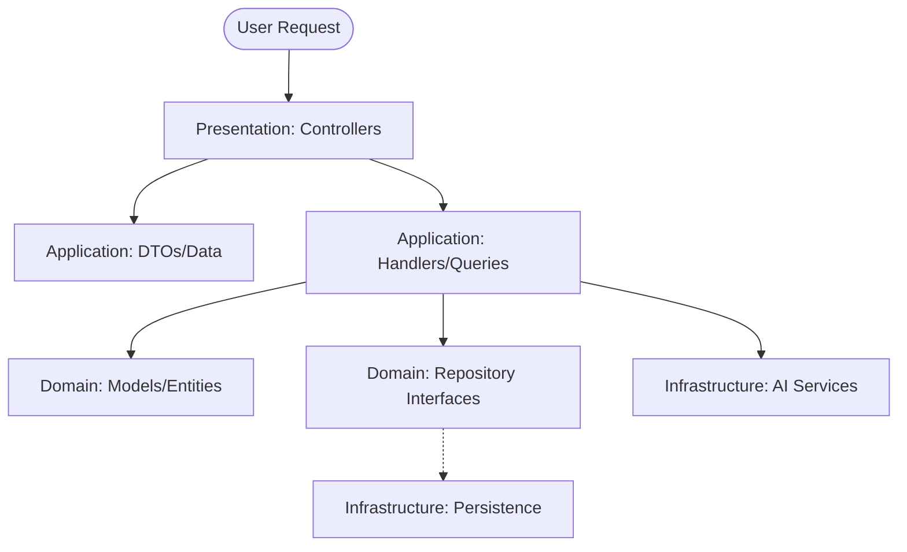

# Requirements

### Overview & Goals
The goal of this task is to perform a full-scale refactoring of the BotSync RAG System to strictly follow **Domain-Driven Design (DDD)** and **Command Query Responsibility Segregation (CQRS)** principles. This will improve maintainability, scalability, and type safety across the application by aligning it with the project's ready-made skills.

### Scope
- **In Scope**:
    - Reorganization of the `app/` directory into four distinct layers: Presentation, Application, Domain, and Infrastructure.
    - Implementation of **Spatie Laravel Data** for DTOs, validation, and transformation.
    - Formalization of CQRS with separate Commands, Handlers, and Queries.
    - Updating all documentation (`SUMMARY.md`, `DOCUMENTATION.md`, `README.md`) to reflect the new architecture.
- **Out of Scope**:
    - Adding new features or changing existing business logic (pure refactoring).
    - Database schema changes (unless strictly required for DDD alignment).

# Technical Design

### Current Implementation
The project currently uses a "DDD-lite" approach with an `app/Domain` folder containing Actions, Models, and Queries. Controllers remain in `app/Http`, and data is passed using standard arrays and FormRequests.

### Key Decisions
1. **Strict 4-Layer DDD**: We will adopt the structure suggested by the `architecture-ddd` skill to clearly separate concerns.
2. **Spatie Laravel Data**: We will replace traditional FormRequests and API Resources with `spatie/laravel-data` DTOs for a "Single Source of Truth" in data handling.
3. **Formal CQRS**: Operations will be split into Commands (Write) and Queries (Read), with explicit Handlers for commands to decouple orchestration from execution.

### Proposed Architecture
- **Presentation Layer (`app/Presentation`)**: Handles HTTP requests, Inertia responses, and CLI commands.
- **Application Layer (`app/Application`)**: Orchestrates use cases via Commands, Handlers, and Queries. Houses DTOs.
- **Domain Layer (`app/Domain`)**: Contains the core business logic, Entities (Models), and Repository Interfaces.
- **Infrastructure Layer (`app/Infrastructure`)**: Technical implementations (AI clients, Vector store managers, Repositories).

### File Structure Example
```text
app/
├── Presentation/
│   └── Controllers/
│       └── AssistantController.php
├── Application/
│   ├── Commands/
│   │   └── StoreAssistantCommand.php
│   ├── Handlers/
│   │   └── StoreAssistantHandler.php
│   ├── Queries/
│   │   └── GetUserAssistantsQuery.php
│   └── Data/
│       └── AssistantData.php
├── Domain/
│   └── Assistant/
│       ├── Models/
│       │   └── Assistant.php
│       └── Repositories/
│           └── AssistantRepositoryInterface.php
└── Infrastructure/
    ├── AI/
    │   └── VectorStoreManager.php
    └── Persistence/
        └── EloquentAssistantRepository.php
```

### Architecture Diagram


# Testing

### Validation Approach
Since this is a structural refactoring, the primary goal is to ensure that existing functionality remains intact while the code is moved and restructured.

### Key Scenarios
1. **End-to-End Smoke Tests**: Verify that the landing page, dashboard, and assistant management (Create/Edit/Delete) still work.
2. **AI Pipeline**: Verify that document uploading, audio transcription, and RAG queries still function correctly through the new layers.
3. **Data Integrity**: Ensure that DTOs correctly validate incoming data and transform outgoing data for the Inertia frontend.

### Validation Tools
- `php artisan test --compact`: Run the existing test suite to ensure no regressions.
- `vendor/bin/pint`: Verify that the new structure follows the established code style.
- `php artisan route:list`: Confirm that all routes are correctly mapped to the new controller locations.

# Delivery Steps

### * Step 1: Setup & Tooling Initialization
Prepare the environment for the refactoring by installing necessary packages and creating the new directory structure.

- Add `spatie/laravel-data` to `composer.json` and install it.
- Create the core DDD directories: `app/Presentation`, `app/Application`, `app/Domain`, and `app/Infrastructure`.
- Publish the `laravel-data` configuration and ensure it is properly initialized.

###   Step 2: Domain & Infrastructure Layer Refactoring
Refactor the core business logic and external service implementations into the Domain and Infrastructure layers.

- Move existing models from `app/Domain/*/Models` to the unified `app/Domain` structure (e.g., `app/Domain/Assistant/Models`).
- Extract AI and Vector Store logic into `app/Infrastructure/AI`.
- Implement Repository interfaces in the Domain layer and their concrete implementations in the Infrastructure layer.
- Ensure all business logic stays within Domain models or Domain Services.

###   Step 3: Application Layer & CQRS Implementation
Convert current Actions and Queries into formal Command/Handler patterns and implement DTOs.

- Create `Spatie\LaravelData\Data` classes in `app/Application/Data` for all input/output data structures.
- Refactor `app/Domain/*/Actions` into `app/Application/Commands` and `app/Application/Handlers`.
- Refactor `app/Domain/*/Queries` into `app/Application/Queries`.
- Ensure Application Services (Handlers) orchestrate Domain objects and return DTOs.

###   Step 4: Presentation Layer & Routing Update
Move and update the web and API entry points to the new Presentation layer.

- Move Controllers to `app/Presentation/Controllers`.
- Move any remaining FormRequests and Resources to `app/Presentation/Requests` and `app/Presentation/Resources`.
- Update `routes/web.php` and `routes/api.php` to reference the new controller locations.
- Ensure Controllers remain thin, delegating all logic to the Application layer.

###   Step 5: Documentation, Validation & Cleanup
Finalize the refactoring with comprehensive documentation and code style alignment.

- Update `SUMMARY.md` with a detailed record of the architectural changes.
- Update `DOCUMENTATION.md` to describe the new DDD + CQRS structure.
- Update `README.md` to link to the new documentation sections.
- Run `vendor/bin/pint --dirty --format agent` to ensure code style consistency.
- Verify all tests pass with `php artisan test --compact`.